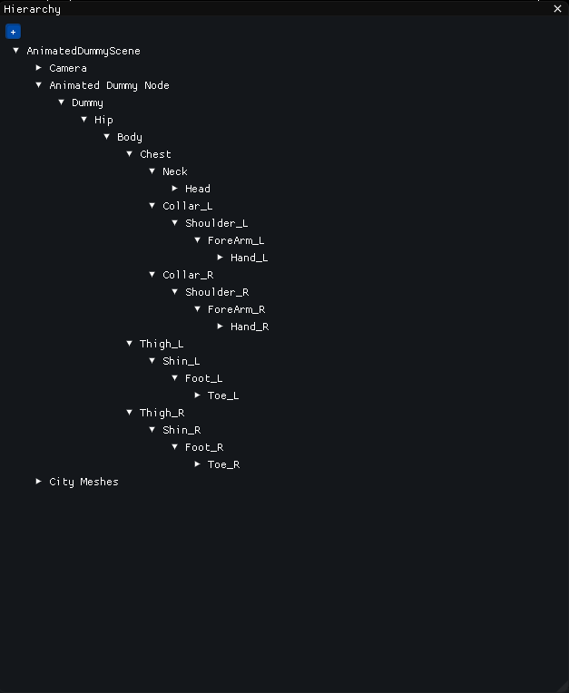

# Vroom Engine
## First commit forked from [solidajenjo/Engine3D](https://github.com/solidajenjo/Engine3D)
## Source code forked from [RagnarEngine](https://github.com/UriKurae/Ragnar-Engine)
We asked the owners of the project to make a fork and work with their code from the second release as a base.
## Description
We are students of the UPC - CITM university developing a Video Game Engine coded mainly in Cpp, with the help of different libraries to help us. Our goal is to end the engine with a High-Level system, which will be a Skeletal Animation system.
## Developers
 - Isaac Digón - [https://github.com/isaac553876299]
 - Isaac Colomer - [https://github.com/IsaaColomer]
 - Ignasi Pardo - [https://github.com/KuronoaScarlet]

## Features
 - Automatically load 'Street Environment'.
 - There is an “Assets” window that shows all user assets.
 - The user can drop/import new files. Assets window reacts properly.
 - Upon start, all resources not managed inside Assets are generated in Library.
 - Various settings and performance metrics in the menus.
 - All resources use reference counting.
 - The editor has 2 windows one with the scene(editor view) and another captured from a gameobject with a camera component(main game camera), each one has its own framebuffer and the user can visualize both at the same time.
 - All meshes use a bounding volume (AABB) and can be discarded using Frustum Culling.
 - Hierarchy: delete, reparent, create empty and create children.
 - Transform: translate, rotate and scale Game Objects.
 - Mesh: select or drop any imported mesh.
 -  Camera is a component with settings that can be modified.
 -  GameObjects can be picked from the world using mouse.

 ## Controls
 - Camera moves with WASD + right click (mouse).
 - Pressing F focusses camera on selected object.
 - Holding SHIFT doubles movement speed.
 - LALT + right click (mouse) rotates around selected object.
 - Mouse wheel up/down zooms scene view.
 - Left click to select a GameObject in the scene.
 - Delete to delete a GameObject.

 ## Main Core Sub-systems
- Free navigation through the different scenes you create. Contains a camera that allows you to view the scene from the "Game" perspective.
- It contains a hierarchy of GameObjects by which you can navigate through all the objects present in the scene. From the corresponding editors you can add different types of components (Transform, Mesh, Material, Animation or Bone).
In addition, you can add, remove or change the parents of GameObjects directly via Drag&Drop.
- It has a scene serialization through json files. Also saving and loading of resources through a custom file format and .meta files.
- Optimization of the frustum culling of static GameObjects using a QuadTree.

## Skeletal Animation System
The system we have been proposed to implement is still under development.

The import of animations and bones is done with the Assimp library, from fbx files.

When the import of the animations is done, the necessary resources and relevant files are created in the Library folder so that they can be selected from the Animation Component editors. 
Bones, on the other hand, are imported when the mesh is imported, since they are part of it. 
As with the animations, the necessary resources and relevant files are created in the Library folder, and through the Mesh Component, it generates all the necessary GameObjects to save the loaded bones there. 

We are currently in the skinning development phase, however, the base of the project, the importers and the saving of information are correctly done and work 100%.

#### How the editor and the component works. 

#### How the hierarchy is shown.

#### Embed video in order to show what it's done.

[

#### Students of 3rd year at CITM degree on Videogames Design and Development

## License
MIT License
Copyright (c) [2021] [Vroom Engine]

Permission is hereby granted, free of charge, to any person obtaining a copy
of this software and associated documentation files (the "Software"), to deal
in the Software without restriction, including without limitation the rights
to use, copy, modify, merge, publish, distribute, sublicense, and/or sell
copies of the Software, and to permit persons to whom the Software is
furnished to do so, subject to the following conditions:

The above copyright notice and this permission notice shall be included in all
copies or substantial portions of the Software.

THE SOFTWARE IS PROVIDED "AS IS", WITHOUT WARRANTY OF ANY KIND, EXPRESS OR
IMPLIED, INCLUDING BUT NOT LIMITED TO THE WARRANTIES OF MERCHANTABILITY,
FITNESS FOR A PARTICULAR PURPOSE AND NONINFRINGEMENT. IN NO EVENT SHALL THE
AUTHORS OR COPYRIGHT HOLDERS BE LIABLE FOR ANY CLAIM, DAMAGES OR OTHER
LIABILITY, WHETHER IN AN ACTION OF CONTRACT, TORT OR OTHERWISE, ARISING FROM,
OUT OF OR IN CONNECTION WITH THE SOFTWARE OR THE USE OR OTHER DEALINGS IN THE
SOFTWARE.
